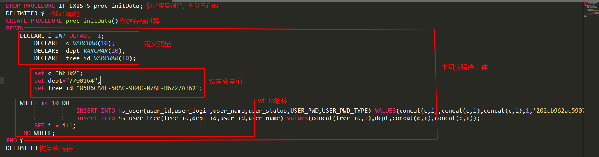

[TOC]
## 记录执行的所有sql
1. ``show variables where Variable_name="general_log";``查看日志是否打开；
若结果为``OFF``,则运行``set global general_log=on;``
2. ``show variables where Variable_name="general_log_file";``查看日志记录位置
3. 注：会记录所有sql，建议只在调试时打开，调试完成后关闭``set global general_log=off;``

## 格式化小数到指定位数
输入`SELECT FORMAT(12562.6655,2);`输出`12562.67`
## 存储过程
1. `DELIMITER $`将标准分隔符`;`改成`$`。与存储过程语法无关，可以将存储过程作为一个整体传递给服务器。结尾再加一个`DELIMITER`可将分隔符复原。
    ```
    DELIMITER $
    DELIMITER
    ```
2. 创建一个存储过程`CREATE PROCEDURE proc_initData()`。
    在这个示例中，存储过程的名称为：`proc_initData`，并把括号放在存储过程的名字之后。
    ```
    CREATE PROCEDURE proc_initData()
    ```
3. 存储过程的主体放在`BEGIN`和`END`之间
4. 在存储过程中定义一个变量`DECLARE  dept VARCHAR(10);`
5. 给变量赋值`set dept="7700164";`
6. 调用存储过程`CALL proc_initData();`
7. 一个例子

## 视图
1. 创建视图
~~~
        CREATE VIEW view_name AS
        SELECT column_name(s)
        FROM table_name
        WHERE condition
~~~
2. 修改视图
~~~
        CREATE OR REPLACE VIEW view_name AS
        SELECT column_name(s)
        FROM table_name
        WHERE condition
~~~
3. 删除视图
~~~
        DROP VIEW view_name
~~~
4. 视图是查询结果集的可视化的表。不是固定的，会根据实际变化而变化。

## key_buffer_size
1. 作用：指定索引缓存区的大小，影响索引处理速度，特别是索引读的速度
2. 状态值比例`key_read/key_read_requests`反应设置是否合理。  
   ``show status like 'key_read%'``获得状态值，至少1:100;1:10000更好
3. 该配置对MyISAM表起作用，即使不使用MyISAM表，内部的临时磁盘表也是MyISAM表，同样需要使用该值。
4. 对于1G内存的机器，如果不使用MyISAM表，推荐值是16M（8-64M）
## max_allowed_packet
1. 限制server接收的数据包大小
2. 查看当前配置``show VARIABLES like '%max_allowed_packet%'``;
3. 修改方法：修改配置文件或者执行sql语句``set global max_allowed_packet = 2*1024*1024*10``;
4. 


/* 首先通过命令行登录mysql,命令为:*/
mysql -h localhost -u username -p
//接下来输入对应的passwprd,进入mysql操作界面

set global log_output=file;
set global general_log_file='file-path.log';
set global general_log=on;
set global general_log=off;


MySQL 错误 1366:1366 Incorrect integer value是数据库模式问题，修改配置文件为中
```sql_mode="NO_ENGINE_SUBSTITUTION,STRICT_TRANS_TABLES"```
## 引擎
### InnoDB和MyISAM的区别是什么？
1. InnoDB支持事务，MyISAM不支持；
2. InnoDB数据存储在共享表空间，MyISAM数据存储在文件中；
3. InnoDB支持行级锁，MyISAM只支持表锁；
4. InnoDB支持崩溃后的恢复，MyISAM不支持；
5. InnoDB支持外键，MyISAM不支持；
6. InnoDB不支持全文索引，MyISAM支持全文索引；
## 存在则更新，不存在则新增
```
        REPLACE INTO `antdbms_xykj`.`im_config` (`CFG_ID`, `CFG_NAME`, `CFG_DATA`, `CFG_TYPE`, `CFG_STATUS`, `CFG_DESC`) VALUES ('4', 'autoclear', '56', 'system', '1', '');
```
## windows下mysql做成服务
1. 进入mysql bin目录
2. `mysqld --install mysql`
3. `net start mysql`启动服务
4. `sc delete mysql`删除服务
## 优化技巧
1. 比较运算符能用 “=”就不用“<>”
2. 明知只有一条查询结果，那请使用 “LIMIT 1”
    `limit 1`避免全局搜索，找到后就不向下查找了。
3. 使用UNION ALL 代替 UNION，如果结果集允许重复的话
4. 为获得相同结果集的多次执行，请保持SQL语句前后一致(查询缓存)


