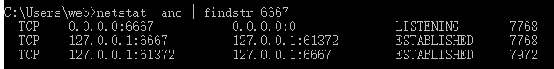

[toc]
1. 查看端口占用情况`netstat -ano |findstr 端口号`

2. 账号密码明明正确却远程不到别的电脑，可能是域有问题，域\用户名登陆

3. 注册组件`regsvr32 xxx.dll`
4. 复制文件夹
```
    xcopy promotion dist\promotion\ /e
```
     注:必须带\
## 计划任务schtasks
 ```
         /Create         创建新计划任务。  
        /Delete         删除计划任务。  
        /Query          显示所有计划任务。  
        /Change         更改计划任务属性。  
        /Run            按需运行计划任务。  
        /End            中止当前正在运行的计划任务。  
        /ShowSid        显示与计划的任务名称相应的安全标识符。  
        /?              显示帮助消息。
```
创建计划任务参数
```
/sc 指定执行频率(如onstart)
/tr 指定计划任务名称
/tn 指定计划任务将运行的程序
```
示例
`schtasks /create /sc onstart /tn memcached /tr "'g:\memcached\memcached.exe' -m 512"
```
## linux子系统
### 开启
1. 设置->更新和安全->开发者选项->启用开发者模式
2. 程序和功能->启用或关闭windows功能->勾选适用于Linux的windows子系统
3. 在Microsoft Store中搜索Ubuntu下载并安装
### 配置ssh连接
1. 在默认命令端输入ifconfig查看IP
2. 配置ssh服务
```
sudo apt-get remove --purge openssh-server   ## 先删ssh
sudo apt-get install openssh-server          ## 在安装ssh
sudo rm /etc/ssh/ssh_config                  ## 删配置文件，让ssh服务自己想办法链接
sudo service ssh --full-restart
sudo systemctl enable ssh                    ## 设置ssh开机自启动
```
3. 使用xshell连接
